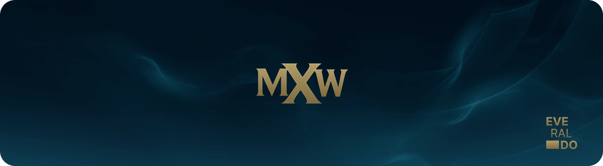
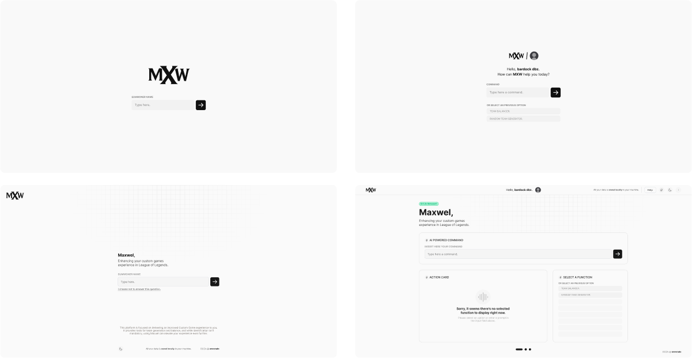

  

# ⚔️ Maxwel

> Enhancing your custom games experience in League of Legends.

Maxwel represents a bespoke League of Legends (LOL) platform crafted exclusively for a tight-knit circle of friends who share a deep passion for the game. In its legacy iteration, Maxwel harnessed the power of the LOL API to access critical player data—ranging from ranks and performance metrics to recent trends. This wealth of information served as the foundation for creating meticulously balanced and engaging custom game experiences within our group. The legacy Maxwel version went a step further by integrating the OpenAI API, enabling the interpretation of user input and seamlessly linking it with various developed functions.

From the initial design of the authentication screen to the intricacies of crafting the database model for data collection, I have been hands-on in the entire project's development. This holistic involvement ensures that Maxwel is not just a gaming platform but a tailored experience, finely tuned to meet the unique dynamics and preferences of our gaming community. If there are specific queries or if assistance is needed with Maxwel or related development endeavors, please don't hesitate to reach out.

  

## ⚙️ What builds Maxwel?

-   [Next](https://nextjs.org/docs)
-   [React](https://reactjs.org)
-   [TypeScript](https://www.typescriptlang.org)
-   [Tailwind](https://tailwindcss.com/)
-   [Framer Motion](https://www.framer.com/motion/)
-   [Eslint](https://eslint.org)
-   [Prettier](https://prettier.io)
-   [Husky](https://github.com/typicode/husky)
-   [Commitlint](https://commitlint.js.org/#/)
-   [Jack-O-Hook](https://github.com/evvvrado/jack-o-hook)
-   [Riot Games API](https://developer.riotgames.com/apis)
-   [OpenAi API](https://openai.com/blog/openai-api)

## ⚖️ License

Maxwel is licensed under the MIT. For more details, see the [LICENSE](./LICENSE) file.

## 📖 Disclaimer

Maxwel has no affiliation with Riot Games or League of Legends.
This is a legacy version, new Maxwel Platform coming soon.

#### ⚙️ forked from [ectoplate](https://github.com/evvvrado/ectoplate) - @evvvrado
